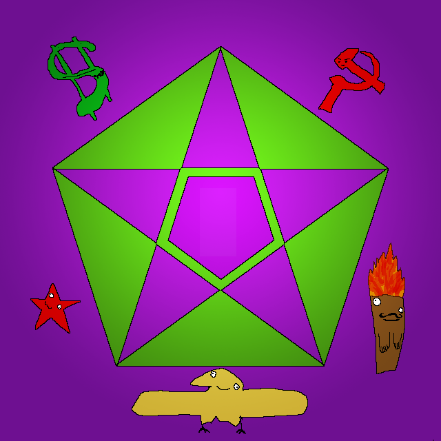

#   Pkomiclaps 
A mod for Europa Universalis IV based on a made up ideology. For funsies.

 

First a word of warning: this is my first ever git hub repo, so be prepared for some serious suboptimality.

## Features

* A new country tag: Pkomiclaps!
    * Formed by any nation through decisions that can be taken at the start of a game.
    * Unique republic, ideas, units, and much more!
    * Inherits the missions of the country it is formed by.
* A new religion: Pastafarianism!
    * Starts as Moralist Pastafarianism before evolving into Drunken Pastafarianism after a few decades.
    * Deities.
* New government types: Pkomiclaps Republics and Lesser Pkomiclaps Republics!
    * Pkomiclaps is a Pkomiclaps Republic
    * By getting friendly with other nations, they might shift to becoming Lesser Pkomiclaps Republics.
        * This allows some not quite working mechanics.
    * If Pkomiclaps' friends don't want to reform, Pkomiclaps gets claims on their land!
* New idea groups: Pastafarianist, Marketing, and Superiority Ideas!
    * Only Clapsers can get them.
    * Include ideas like: Lower Wages, Incredibly Awkward, and Better Weapons!
* New trade good: Goat horns!
    * Goat horns!
* New events: All sorts!
    * Conquest events as rewards for Pkomiclaps when they conquer specific areas.
    * Other events.
* Absorption
    * If Pkomiclaps surrounds another country, they will surely, but slowly, be absorbed.
* Localisation!
    * Polanball like names for stuff.
* Call centers!
* Racism!
* Bugs!
* Other stuff I've forgotten about!

## Usage

The descriptor calls this mod "Pkomiclaps Dev". That's because I clone it into mod/Pkomiclaps Dev so I can have a seperate directory for a working pkomiclaps.
